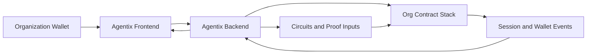
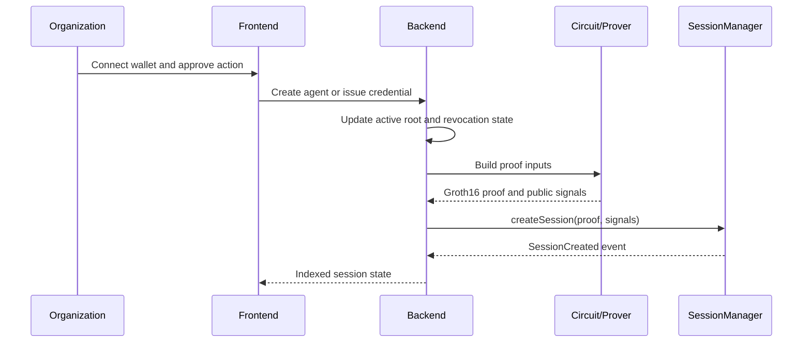

# Agentix

Agentix is a protocol and operator platform for issuing private credentials to AI agents, proving authorization with zero knowledge, and creating on-chain sessions and wallets under explicit policy control.

It is built for teams that want:

- private agent credentials instead of public allowlists
- signed platform operations for every on-chain write
- per-organization contract isolation
- a hosted operator workflow and a self-hosted SDK path

## What Agentix Does

With Agentix, an organization can:

- connect an owner wallet
- create an organization workspace
- register agent identities
- deploy an organization-specific contract stack
- issue credentials to agents
- create and fund agent wallets
- open policy-bound sessions
- revoke credential-based access
- inspect indexed on-chain events with direct Etherscan links

## System Flow



## Session Creation Flow



## Architecture

```text
agentix/
|-- frontend/    Next.js operator platform
|-- backend/     Express API, storage, proofs, event sync
|-- circuits/    Circom circuit and proving artifacts
|-- contracts/   Solidity protocol contracts
|-- sdk/         Self-hosted SDK path
|-- docs/        Setup, API, and architecture docs
`-- quickstart.md
```

## Start The Application

From the repository root:

```powershell
npm install --workspaces
npm run dev
```

The dev launcher starts both services and prints the live URLs:

- frontend: `http://127.0.0.1:3001`
- backend: `http://127.0.0.1:3000`

## Core Product Properties

- Credentials are stored as commitments, not raw secrets.
- Session creation is gated by a zero-knowledge proof.
- Every platform-triggered on-chain action requires a wallet signature.
- Each organization gets its own `CredentialRegistry`, `SessionManager`, and `AgentWalletFactory`.
- `Verifier` and wallet implementation are shared infrastructure, while organization state remains isolated.

## Documentation

- [quickstart.md](./quickstart.md): start, run, redeploy, and troubleshoot
- [docs/ARCHITECTURE.md](./docs/ARCHITECTURE.md): system design
- [docs/API.md](./docs/API.md): backend routes and operator actions
- [docs/SETUP.md](./docs/SETUP.md): environment and deployment setup
- [sdk/README.md](./sdk/README.md): Agentix SDK and self-hosted flow

## Network

Current default network:

- network: `Sepolia`
- chain id: `11155111`

## Repository Notes

Do not commit:

- `backend/.env`
- local SQLite database files
- proving artifacts from `circuits/build/`
- `.next/`, `dist/`, or `node_modules/`

The root `.gitignore` is already prepared for GitHub upload.
