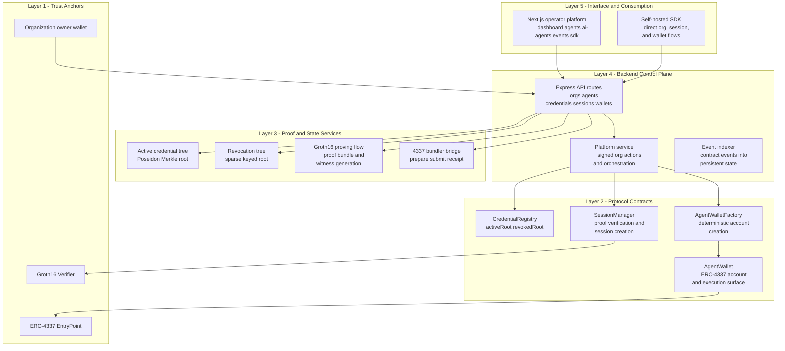
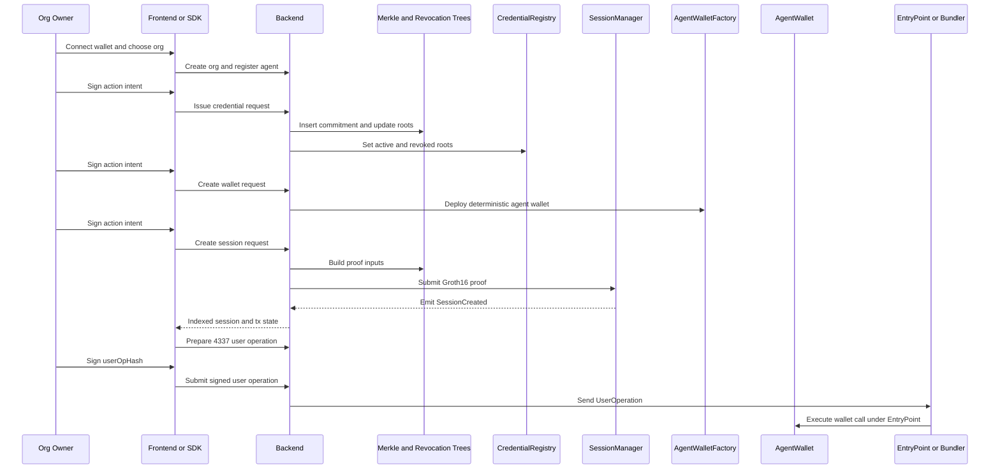
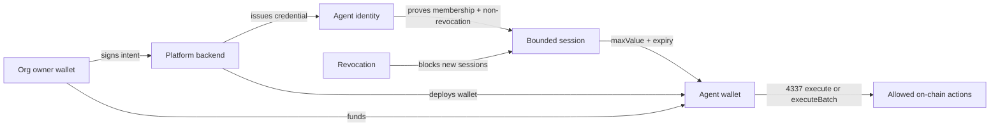

# AGENTIX - The Private Agent Authorization Rail

**Built to give autonomous agents constrained, revocable, on-chain access without exposing raw credentials**


## Live Deployment

| Contract | Address | Network |
|----------|---------|---------|
| Verifier | [0x18a2...2379](https://sepolia.etherscan.io/address/0x18a2447623f8DD51f13a41025cddFa218d0B2379) | Sepolia |
| CredentialRegistry | [0x5578...dEd7](https://sepolia.etherscan.io/address/0x5578d8DC741bcfAA199BCD0eDE68dcB3eb5EdEd7) | Sepolia |
| SessionManager | [0xCfc4...Ab65](https://sepolia.etherscan.io/address/0xCfc4543476069Ed15f5749B527BC35fEAcA1Ab65) | Sepolia |
| AgentWalletFactory | [0x2fA2...7970](https://sepolia.etherscan.io/address/0x2fA255257c301755288e85DedAAe99d54f367970) | Sepolia |
| AgentWallet Implementation | [0x97D6...C7F7](https://sepolia.etherscan.io/address/0x97D6893A5483005eCed724FfedAAeaaAf6Da0C7F7) | Sepolia |
| EntryPoint | [0x4337...F108](https://sepolia.etherscan.io/address/0x4337084D9E255Ff0702461CF8895CE9E3b5Ff108) | Sepolia |

## Frontend Pages

| Route | Description |
|-------|-------------|
| `/` | Protocol landing page and high-level operator story |
| `/dashboard` | Organization workspace, contract stack, treasury actions, and indexed state |
| `/agents` | Agent inventory for the active organization |
| `/agents/[id]` | Per-agent credential, wallet, session, funding, and user-op surface |
| `/ai-agents` | Provider-first AI agent connect flow |
| `/external-agents` | External agent integrations, security audits, whitelists, and credentials |
| `/events` | Indexed contract activity feed |
| `/sdk` | Self-hosted SDK path and direct integration story |
| `/integration` | SDK/self-host redirect surface |

## Quick Start (30 seconds)

```bash
# install
npm install --workspaces

# configure backend and frontend env files
copy backend\.env.example backend\.env
copy frontend\.env.example frontend\.env.local

# start both services
npm run dev
```

Then open:

- frontend: `http://127.0.0.1:3001`
- backend: `http://127.0.0.1:3000`

Full setup and redeploy guide: [quickstart.md](./quickstart.md)

## The Vision

Agentix is a private authorization rail for the agent economy.

It gives organizations a way to:

- create agent identities under an organization workspace
- issue private credentials without publishing plaintext allowlists
- deploy organization-scoped contract stacks
- fund agent wallets without directly handing unrestricted treasury access to model providers
- create bounded sessions with expiry and value constraints
- revoke future session access without revealing the agent secret
- operate ERC-4337-ready wallets through a managed operator surface or a self-hosted SDK

**Default operator scenario:** "Connect. Credential. Wallet. Session. Execute."

- the org owner connects a wallet
- the org creates an agent
- the org issues a credential commitment
- the org deploys a wallet and funds it
- the backend or SDK proves credential validity in zero knowledge
- the session manager opens a bounded session
- the wallet executes only within that session boundary

## Agentix Layered Architecture

This is the concrete architecture implemented in this repository.



### End-to-End execution path



### Access and money model



Interpretation:

- **model provider != treasury holder**
- **agent wallet holds value**
- **credential binds the identity**
- **session defines the spend boundary**
- **revocation stops future session creation**

## Key Features Implemented

### Smart contracts

- **CredentialRegistry.sol**: stores active and revoked roots on-chain
- **SessionManager.sol**: validates Groth16 proofs and creates replay-safe sessions
- **AgentWalletFactory.sol**: deploys deterministic organization-linked wallets
- **AgentWallet.sol**: ERC-4337-style smart account with owner/session execution model
- **Verifier.sol**: Groth16 verifier generated from the current circuit

### Backend

- organization, agent, credential, session, wallet, and indexed event persistence
- Poseidon-based active Merkle tree and sparse revocation tree handling
- proof bundle and witness generation, and session submission
- organization-owner signed action enforcement
- contract deployment and event indexing
- 4337 bundler prepare/submit/receipt flow

### Frontend

- wallet-connected operator platform
- organization workspace switching and creation
- provider-first AI agent connect flow
- credential issuance, wallet deployment, funding, session creation, and revocation
- indexed event and transaction visibility
- Etherscan links for all surfaced transactions
 - includes a legacy Vite-based UI at `frontend_legacy/` for maintenance and migration

### SDK

- self-hosted organization and agent workflows
- direct proof and session orchestration
- wallet and session automation outside the hosted UI

## Project Structure

Below is a hierarchical tree of files and folders in the repository (paths are relative to the project root `agent-credentials-mvp/`).

```text
agent-credentials-mvp/
├── .env.example
├── .gitignore
├── LICENSE.md
├── package.json
├── package-lock.json
├── quickstart.md
├── README.md
├── scripts/
│   ├── start-dev.ps1
│   ├── start-dev.cmd
│   └── e2e-test.js
├── docs/
│   ├── SETUP.md
│   ├── ARCHITECTURE.md
│   └── API.md
├── frontend/
│   ├── .env.example
│   ├── package.json
│   ├── package-lock.json
│   ├── next.config.mjs
│   ├── next-env.d.ts
│   ├── vercel.json
│   ├── postcss.config.mjs
│   ├── tsconfig.json
│   ├── components.json
│   ├── app/
│   │   ├── layout.tsx
│   │   ├── page.tsx
│   │   ├── globals.css
│   │   ├── dashboard/
│   │   │   └── page.tsx
│   │   ├── agents/
│   │   │   └── page.tsx
│   │   ├── agents/[id]/
│   │   │   └── page.tsx
│   │   ├── agent/[id]/
│   │   │   └── page.tsx
│   │   ├── ai-agents/
│   │   │   └── page.tsx
│   │   ├── external-agents/
│   │   │   └── page.tsx
│   │   ├── events/
│   │   │   └── page.tsx
│   │   ├── sdk/
│   │   │   └── page.tsx
│   │   ├── integration/
│   │   │   └── page.tsx
│   │   ├── login/
│   │   │   └── page.tsx
│   │   └── api/
│   │       ├── auth/
│   │       │   ├── login/route.ts
│   │       │   ├── logout/route.ts
│   │       │   └── me/route.ts
│   │       ├── external/[[...path]]/route.ts
│   │       └── platform/
│   │           ├── org/select/route.ts
│   │           ├── orgs/[orgId]/route.ts
│   │           ├── orgs/[orgId]/deploy/route.ts
│   │           ├── orgs/[orgId]/fund/route.ts
│   │           ├── agents/route.ts
│   │           ├── agents/[agentId]/wallet/route.ts
│   │           ├── agents/[agentId]/credential/route.ts
│   │           ├── agents/[agentId]/session/route.ts
│   │           ├── agents/[agentId]/fund/route.ts
│   │           ├── agents/[agentId]/revoke/route.ts
│   │           ├── wallets/[walletAddress]/userop/prepare/route.ts
│   │           ├── wallets/[walletAddress]/userop/submit/route.ts
│   │           └── wallets/userops/[userOpHash]/route.ts
│   ├── components/
│   │   ├── header.tsx
│   │   ├── footer.tsx
│   │   ├── landing/
│   │   │   ├── hero-section.tsx
│   │   │   ├── features-section.tsx
│   │   │   ├── cta-section.tsx
│   │   │   └── integration-section.tsx
│   │   ├── auth/auth-form.tsx
│   │   ├── agent/
│   │   │   ├── agent-card.tsx
│   │   │   ├── agent-detail.tsx
│   │   │   ├── agent-detail-actions.tsx
│   │   │   ├── agent-identity.tsx
│   │   │   ├── credentials-list.tsx
│   │   │   ├── sessions-list.tsx
│   │   │   └── wallets-list.tsx
│   │   ├── wallet/
│   │   │   ├── wallet-provider.tsx
│   │   │   ├── connect-wallet-button.tsx
│   │   │   └── wallet-card.tsx
│   │   ├── event-timeline.tsx
│   │   ├── dashboard/
│   │   │   ├── events-feed.tsx
│   │   │   ├── agents-table.tsx
│   │   │   ├── overview-cards.tsx
│   │   │   └── sessions-table.tsx
│   │   ├── platform/
│   │   │   ├── workspace-controls.tsx
│   │   │   ├── org-actions.tsx
│   │   │   ├── agent-actions.tsx
│   │   │   └── wallet-userop-panel.tsx
│   │   ├── effects/
│   │   │   ├── spotlight-card.tsx
│   │   │   ├── split-reveal.tsx
│   │   │   ├── grid-backdrop.tsx
│   │   │   └── depth-orbit.tsx
│   │   ├── common/
│   │   │   ├── code-block.tsx
│   │   │   ├── stack-metrics.tsx
│   │   │   ├── signal-strip.tsx
│   │   │   ├── stat-card.tsx
│   │   │   └── status-badge.tsx
│   │   ├── ui/ (many UI primitives)
│   │   ├── credential-card.tsx
│   │   └── theme-provider.tsx
│   ├── hooks/
│   │   ├── use-toast.ts
│   │   └── use-mobile.ts
│   ├── lib/
│   │   ├── ai-api.ts
│   │   ├── api-base.ts
│   │   ├── auth.ts
│   │   ├── external-agents-api.ts
│   │   ├── explorer.ts
│   │   ├── mock-api.ts
│   │   ├── mock-data.ts
│   │   ├── org-session.ts
│   │   ├── signed-actions.ts
│   │   ├── types.ts
│   │   └── utils.ts
│   └── public/
│       ├── icon.svg
│       ├── icon-light-32x32.png
│       ├── icon-dark-32x32.png
│       ├── apple-icon.png
│       ├── placeholder.svg
│       ├── placeholder.jpg
│       ├── placeholder-user.jpg
│       ├── placeholder-logo.svg
│       ├── placeholder-logo.png
│       └── provider-logos/
│           ├── anthropic.svg
│           ├── cohere.svg
│           ├── deepseek.svg
│           ├── google.svg
│           ├── openai.svg
│           └── xai.svg
├── backend/
│   ├── .env.example
│   ├── package.json
│   ├── railway.json
│   ├── tsconfig.json
│   ├── db/
│   │   └── schema.sql
│   └── src/
│       ├── index.ts
│       ├── db.ts
│       ├── types/
│       │   ├── http.ts
│       │   └── externalAgent.ts
│       ├── middleware/
│       │   ├── auth.ts
│       │   └── security.ts
│       ├── utils/
│       │   ├── validation.ts
│       │   ├── errors.ts
│       │   └── crypto.ts
│       ├── routes/
│       │   ├── orgs.ts
│       │   ├── agents.ts
│       │   ├── credentials.ts
│       │   ├── sessions.ts
│       │   ├── wallets.ts
│       │   ├── proofs.ts
│       │   ├── events.ts
│       │   ├── externalAgents.ts
│       │   ├── auth.ts
│       │   ├── simple.ts
│       │   └── v1.ts
│       ├── services/
│       │   ├── platform.ts
│       │   ├── auth.ts
│       │   ├── actionAuth.ts
│       │   ├── blockchain.ts
│       │   ├── bundler.ts
│       │   ├── credential.ts
│       │   ├── eventSync.ts
│       │   ├── externalAgent.ts
│       │   ├── merkle.ts
│       │   ├── prover.ts
│       │   ├── revocationTree.ts
│       │   └── session.ts
│       └── circomlib/
│           ├── README.md
│           ├── index.js
│           ├── package.json
│           ├── package-lock.json
│           ├── LICENSE
│           └── test/
├── contracts/
│   ├── .env.example
│   ├── package.json
│   ├── tsconfig.json
│   ├── hardhat.config.ts
│   ├── src/
│   │   ├── AgentWallet.sol
│   │   ├── AgentWalletFactory.sol
│   │   ├── CredentialRegistry.sol
│   │   ├── SessionManager.sol
│   │   └── Verifier.sol
│   ├── scripts/
│   │   ├── deploy.ts
│   │   ├── deploy-ethers.js
│   │   └── verify.ts
│   └── test/
├── circuits/
│   ├── credential.circom
│   ├── test/credential.test.js
│   ├── build/
│   └── circomlib/
│       ├── package.json
│       ├── README.md
│       ├── index.js
│       ├── LICENSE
│       ├── circuits/
│       └── test/
└── sdk/
    ├── package.json
    ├── tsconfig.json
    ├── README.md
    ├── src/
    │   ├── index.ts
    │   ├── AgentClient.ts
    │   ├── SessionManager.ts
    │   └── types.ts
    └── examples/
        ├── create-session.ts
        └── perform-action.ts
```


## Development Scripts

From the repository root:

```bash
npm run dev
npm run dev:backend
npm run dev:frontend
npm run build
npm run test:contracts
npm run example:create-session
```

## Deployment Model

### Frontend

- deploy `frontend/` to Vercel
- set:
  - `AGENT_CREDENTIALS_API_URL`
  - `NEXT_PUBLIC_AGENT_CREDENTIALS_API_URL`

### Backend

- deploy `backend/` as a long-running Node service
- Railway is the simplest fit for the current architecture
- recommended config:
  - persistent volume for SQLite
  - `DB_PATH=/data/database.sqlite`
  - `ENABLE_EVENT_SYNC=true` on one instance
  - `RPC_URL` or `RPC_URLS`
  - `BUNDLER_URL` or `BUNDLER_URLS`
  - `PRIVATE_KEY`

### Important operational note

The frontend is serverless-friendly. The backend is not Vercel-native as-is because it relies on:

- persistent database state
- long-running event indexing
- ongoing chain orchestration

## Security and trust assumptions

- raw agent secrets do not appear on-chain
- every critical operator action requires a wallet signature
- organization state is isolated by per-org contract deployment
- revocation prevents future session creation rather than deleting historical state
- wallet funding does not imply unrestricted model access
- session boundaries, not provider identity alone, define spend permissions

## Additional Documentation

- [quickstart.md](./quickstart.md) - start, redeploy, and environment flow
- [docs/ARCHITECTURE.md](./docs/ARCHITECTURE.md) - deeper architecture notes
- [docs/SETUP.md](./docs/SETUP.md) - setup and deployment details
- [docs/API.md](./docs/API.md) - backend route reference
- [sdk/README.md](./sdk/README.md) - SDK usage

## License

AGENTIX is source-available under the Business Source License 1.1 (BUSL-1.1).

You may:
- view the source
- fork the repository
- experiment locally
- use for research and non-commercial purposes

You may NOT:
- commercially deploy the protocol
- create competing hosted services
- use the protocol in production commercially without permission

The license automatically converts to Apache 2.0 on January 1, 2030.

See the LICENSE file for full terms.

---

*"The cleanest agent systems are the ones that never confuse identity, permission, and money."*
