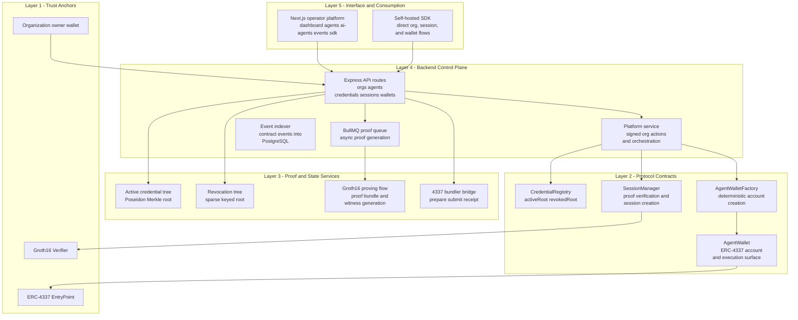
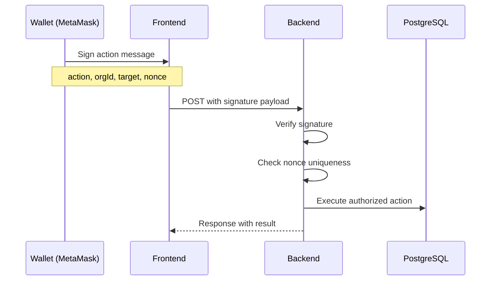
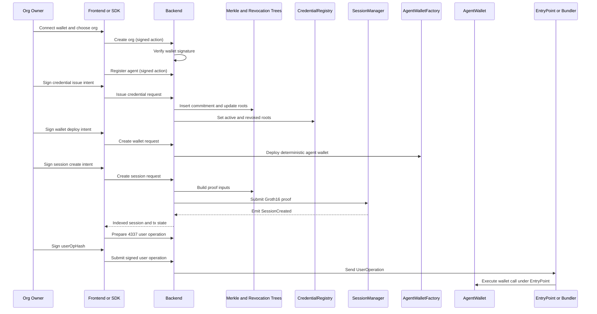
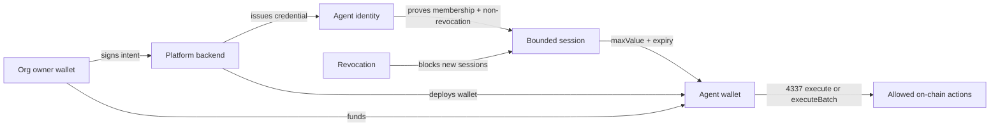

# AGENTIX - The Private Agent Authorization Rail

**Built to give autonomous agents constrained, revocable, on-chain access without exposing raw credentials**


## Live Deployment

| Contract | Address | Network |
|----------|---------|---------|
| Verifier | [0x18a2...2379](https://sepolia.etherscan.io/address/0x18a2447623f8DD51f13a41025cddFa218d0B2379) | Sepolia |
| CredentialRegistry | [0x5578...dEd7](https://sepolia.etherscan.io/address/0x5578d8DC741bcfAA199BCD0eDE68dcB3eb5EdEd7) | Sepolia |
| SessionManager | [0xCfc4...Ab65](https://sepolia.etherscan.io/address/0xCfc4543476069Ed15f5749B527BC35fEAcA1Ab65) | Sepolia |
| AgentWalletFactory | [0x2fA2...7970](https://sepolia.etherscan.io/address/0x2fA255257c301755288e85DedAAe99d54f367970) | Sepolia |
| AgentWallet Implementation | [0x97D6...C7F7](https://sepolia.etherscan.io/address/0x97D6893A5483005eCed724FfedAAeaaAf6Da0C7F7) | Sepolia |
| EntryPoint | [0x4337...F108](https://sepolia.etherscan.io/address/0x4337084D9E255Ff0702461CF8895CE9E3b5Ff108) | Sepolia |

## Frontend Pages

| Route | Description |
|-------|-------------|
| `/` | Protocol landing page with 3D neural hero |
| `/dashboard` | Organization workspace, contract stack, treasury actions |
| `/agents` | Agent inventory for the active organization |
| `/agents/new` | Create new agent form |
| `/agents/[id]` | Per-agent credential, wallet, session, funding surface |
| `/agent/[id]` | Alternative agent detail view |
| `/ai-agents` | Provider-first AI agent connect flow |
| `/external-agents` | External agent integrations |
| `/credentials` | Credentials overview page |
| `/credentials/issue` | Issue new credential form |
| `/sessions` | Sessions overview page |
| `/events` | Indexed contract activity feed |
| `/docs` | Documentation page |
| `/sdk` | Self-hosted SDK path and integration guide |
| `/integration` | SDK/self-host redirect surface |
| `/login` | Login page (legacy session auth) |

## Quick Start (30 seconds)

```bash
# install
npm install --workspaces

# configure environment
copy backend\.env.example backend\.env
copy frontend\.env.example frontend\.env.local

# start backend (port 3001)
npm run dev:backend

# start frontend (port 3000) in another terminal
npm run dev:frontend
```

Then open:
- Frontend: `http://127.0.0.1:3000`
- Backend API: `http://127.0.0.1:3001`

Full setup guide: [quickstart.md](./quickstart.md)

## The Vision

Agentix is a private authorization rail for the agent economy.

It gives organizations a way to:

- Create agent identities under an organization workspace
- Issue private credentials without publishing plaintext allowlists
- Deploy organization-scoped contract stacks
- Fund agent wallets without directly handing unrestricted treasury access to model providers
- Create bounded sessions with expiry and value constraints
- Revoke future session access without revealing the agent secret
- Operate ERC-4337-ready wallets through a managed operator surface or a self-hosted SDK

**Default operator scenario:** "Connect. Credential. Wallet. Session. Execute."

- The org owner connects a wallet (MetaMask on Sepolia)
- The org creates an agent
- The org issues a credential commitment
- The org deploys a wallet and funds it
- The backend or SDK proves credential validity in zero knowledge
- The session manager opens a bounded session
- The wallet executes only within that session boundary

## Agentix Layered Architecture

This is the concrete architecture implemented in this repository.



### Authentication Flow

All critical platform actions require wallet signature authentication:



### End-to-End Execution Path



### Access and Money Model



Interpretation:

- **model provider != treasury holder**
- **agent wallet holds value**
- **credential binds the identity**
- **session defines the spend boundary**
- **revocation stops future session creation**

## Key Features Implemented

### Smart Contracts

- **CredentialRegistry.sol**: Stores active and revoked roots on-chain
- **SessionManager.sol**: Validates Groth16 proofs and creates replay-safe sessions
- **AgentWalletFactory.sol**: Deploys deterministic organization-linked wallets
- **AgentWallet.sol**: ERC-4337-style smart account with owner/session execution model
- **Verifier.sol**: Groth16 verifier generated from the credential circuit

### Backend

- Organization, agent, credential, session, wallet, and indexed event persistence
- PostgreSQL database with connection pooling and SSL support
- Poseidon-based active Merkle tree and sparse revocation tree handling
- BullMQ proof queue for async proof generation
- Groth16 proof bundle and witness generation, session submission
- Wallet signature authentication for all critical actions
- Contract deployment and event indexing
- ERC-4337 bundler prepare/submit/receipt flow

### Frontend

- Wallet-connected operator platform (MetaMask, Sepolia)
- EIP-6963 multi-provider discovery
- Organization workspace switching and creation
- Provider-first AI agent connect flow
- Credential issuance, wallet deployment, funding, session creation, and revocation
- Indexed event and transaction visibility
- Etherscan links for all surfaced transactions
- 3D landing page with Three.js neural visualization

### SDK

- Self-hosted organization and agent workflows
- Direct proof and session orchestration
- Wallet and session automation outside the hosted UI
- AgentClient for credential registration
- SessionManager for ZK proof generation

## Project Structure

```text
agent-credentials-mvp/
├── package.json              # Workspace root
├── README.md
├── quickstart.md
├── PERSONATEST.md            # Developer persona analysis
├── docs/
│   ├── SETUP.md
│   ├── ARCHITECTURE.md
│   └── API.md
├── frontend/                 # Next.js 14 operator platform
│   ├── app/                  # App router pages
│   │   ├── page.tsx          # Landing page
│   │   ├── dashboard/        # Org workspace
│   │   ├── agents/           # Agent inventory
│   │   ├── ai-agents/        # Provider connect
│   │   ├── credentials/      # Credential management
│   │   ├── sessions/         # Session overview
│   │   └── api/              # API routes
│   │       ├── external/     # External agent proxy
│   │       └── platform/     # Platform API proxy
│   ├── components/           # React components
│   │   ├── wallet/           # Wallet provider & connect
│   │   ├── platform/         # Org/agent actions
│   │   └── effects/          # 3D visual effects
│   └── lib/                  # Utilities
├── backend/                  # Express API server
│   ├── src/
│   │   ├── index.ts          # Server entry
│   │   ├── db.ts             # PostgreSQL connection
│   │   ├── routes/           # API endpoints
│   │   │   ├── orgs.ts
│   │   │   ├── agents.ts
│   │   │   ├── credentials.ts
│   │   │   ├── sessions.ts
│   │   │   ├── wallets.ts
│   │   │   ├── proofs.ts
│   │   │   ├── events.ts
│   │   │   ├── externalAgents.ts
│   │   │   └── ai.ts
│   │   ├── services/         # Business logic
│   │   │   ├── platform.ts
│   │   │   ├── actionAuth.ts # Wallet signature verification
│   │   │   ├── merkle.ts
│   │   │   ├── revocationTree.ts
│   │   │   ├── prover.ts
│   │   │   ├── proofQueue.ts # BullMQ queue
│   │   │   ├── blockchain.ts
│   │   │   └── eventSync.ts
│   │   └── middleware/
│   │       ├── auth.ts
│   │       └── security.ts
│   └── db/
│       └── schema.sql
├── contracts/                # Solidity protocol
│   ├── src/
│   │   ├── CredentialRegistry.sol
│   │   ├── SessionManager.sol
│   │   ├── AgentWalletFactory.sol
│   │   ├── AgentWallet.sol
│   │   └── Verifier.sol
│   ├── scripts/
│   │   └── deploy.ts
│   └── test/
├── circuits/                 # Circom ZK circuits
│   ├── credential.circom
│   └── build/                # Compiled artifacts
└── sdk/                      # Self-hosted integration
    ├── src/
    │   ├── index.ts
    │   ├── AgentClient.ts
    │   ├── SessionManager.ts
    │   └── types.ts
    └── examples/
```

## Development Scripts

From the repository root:

```bash
npm run dev              # Start both frontend and backend
npm run dev:backend      # Start backend only (port 3001)
npm run dev:frontend     # Start frontend only (port 3000)
npm run build            # Build all workspaces
npm run test:contracts   # Run contract tests
npm run example:create-session  # Run SDK example
```

## API Endpoints

### Platform Routes (Require Wallet Signature)

| Method | Endpoint | Description |
|--------|----------|-------------|
| POST | `/orgs` | Create organization |
| GET | `/orgs` | List organizations |
| GET | `/orgs/:orgId` | Get organization details |
| DELETE | `/orgs/:orgId` | Delete organization |
| POST | `/orgs/:orgId/deploy-contracts` | Deploy contract stack |
| POST | `/orgs/:orgId/fund` | Fund organization |
| POST | `/agents` | Create agent |
| GET | `/agents` | List agents (requires `orgId` query param) |
| GET | `/agents/types` | Get agent types |
| POST | `/agents/:agentId/credential` | Issue credential |
| POST | `/agents/:agentId/wallet` | Deploy agent wallet |
| POST | `/agents/:agentId/session` | Create session |
| POST | `/agents/:agentId/fund` | Fund agent wallet |
| POST | `/agents/:agentId/revoke` | Revoke credential |
| POST | `/wallets/:walletAddress/userop/prepare` | Prepare user operation |
| POST | `/wallets/:walletAddress/userop/submit` | Submit user operation |
| GET | `/wallets/userops/:userOpHash` | Get user operation status |

### External Agent Routes

| Method | Endpoint | Description |
|--------|----------|-------------|
| GET | `/external/types` | Get external agent types |
| POST | `/external` | Create external agent |
| GET | `/external` | List external agents |

### Public Routes

| Method | Endpoint | Description |
|--------|----------|-------------|
| GET | `/health` | Health check |
| GET | `/proofs/:agentId` | Get merkle proof for agent |

## Deployment Model

### Frontend

- Deploy `frontend/` to Vercel
- Environment variables:
  - `AGENT_CREDENTIALS_API_URL` (internal API URL)
  - `NEXT_PUBLIC_AGENT_CREDENTIALS_API_URL` (public API URL)

### Backend

- Deploy `backend/` as a long-running Node service
- Recommended platforms: Railway, AWS ECS, DigitalOcean
- Required environment:
  - `DATABASE_URL` (PostgreSQL connection string)
  - `RPC_URL` or `RPC_URLS` (Ethereum RPC)
  - `PRIVATE_KEY` (for transaction signing)
  - `BUNDLER_URL` (ERC-4337 bundler)
  - `REDIS_URL` (for BullMQ proof queue)

### Database

- PostgreSQL 14+ required
- Supports AWS RDS, Neon, Supabase, or self-hosted
- Connection pooling enabled by default
- SSL required for production

### Important Notes

- The frontend is serverless-friendly (Vercel)
- The backend requires persistent hosting due to:
  - PostgreSQL database state
  - Event indexing processes
  - Proof queue workers
  - Chain orchestration

## Security and Trust Assumptions

- Raw agent secrets do not appear on-chain
- Every critical operator action requires a wallet signature
- Organization state is isolated by per-org contract deployment
- Nonce-based replay protection for all signed actions
- Revocation prevents future session creation (does not delete history)
- Wallet funding does not imply unrestricted model access
- Session boundaries define spend permissions, not provider identity alone

## Additional Documentation

- [quickstart.md](./quickstart.md) - Start, redeploy, and environment flow
- [docs/ARCHITECTURE.md](./docs/ARCHITECTURE.md) - Deeper architecture notes
- [docs/SETUP.md](./docs/SETUP.md) - Setup and deployment details
- [docs/API.md](./docs/API.md) - Backend route reference
- [sdk/README.md](./sdk/README.md) - SDK usage
- [PERSONATEST.md](./PERSONATEST.md) - Developer persona analysis and design critique

## License

Apache 2.0

---

*"The cleanest agent systems are the ones that never confuse identity, permission, and money."*
