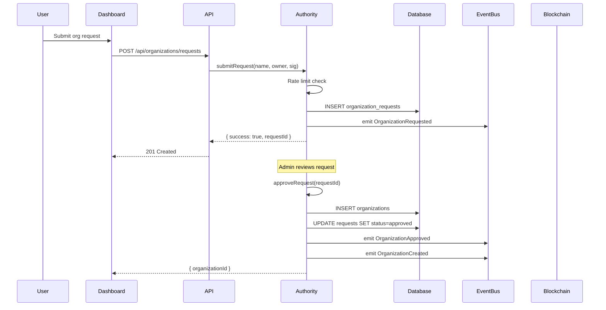
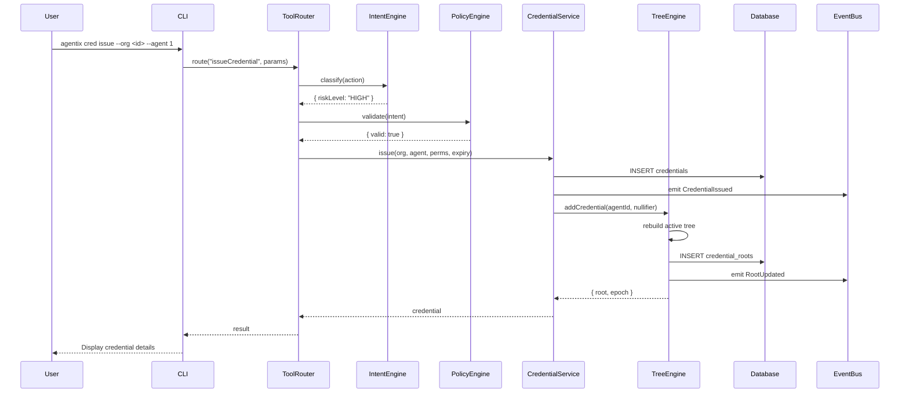
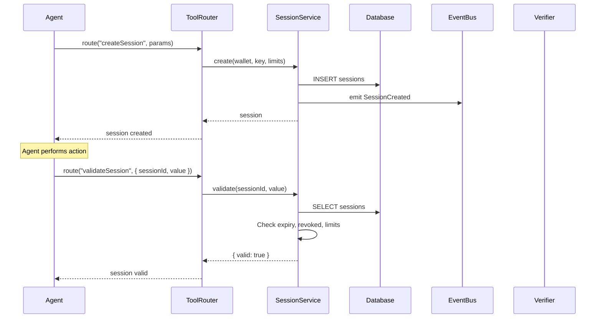
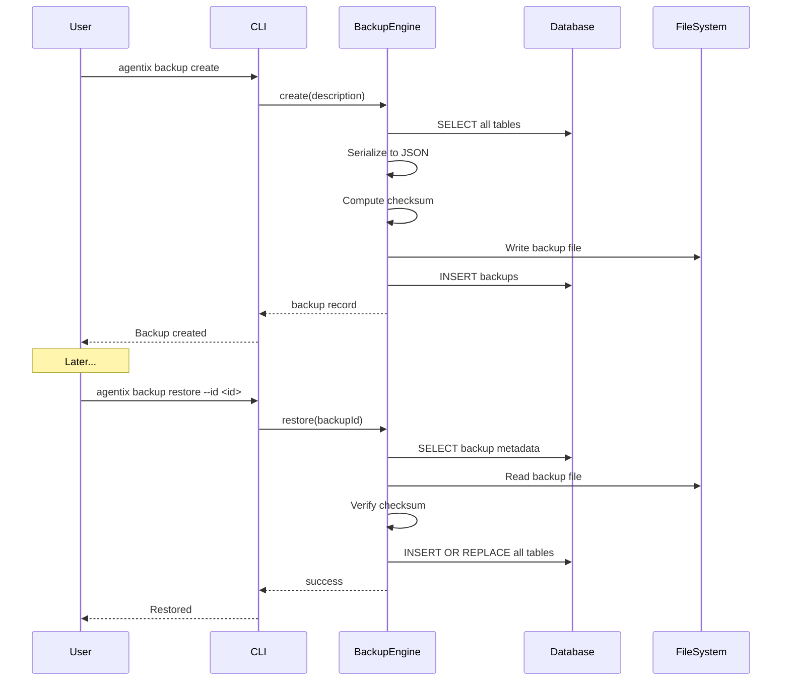

# Sequence Diagrams

## Organization Onboarding

```mermaid
sequenceDiagram
    participant User
    participant Dashboard
    participant API
    participant Authority
    participant Database
    participant EventBus
    participant Blockchain

    User->>Dashboard: Submit org request
    Dashboard->>API: POST /api/organizations/requests
    API->>Authority: submitRequest(name, owner, sig)
    Authority->>Authority: Rate limit check
    Authority->>Database: INSERT organization_requests
    Authority->>EventBus: emit OrganizationRequested
    Authority-->>API: { success: true, requestId }
    API-->>Dashboard: 201 Created

    Note over Authority: Admin reviews request

    Authority->>Authority: approveRequest(requestId)
    Authority->>Database: INSERT organizations
    Authority->>Database: UPDATE requests SET status=approved
    Authority->>EventBus: emit OrganizationApproved
    Authority->>EventBus: emit OrganizationCreated
    Authority-->>Dashboard: { organizationId }
```

## Credential Issuance

```mermaid
sequenceDiagram
    participant User
    participant CLI
    participant ToolRouter
    participant IntentEngine
    participant PolicyEngine
    participant CredentialService
    participant TreeEngine
    participant Database
    participant EventBus

    User->>CLI: agentix cred issue --org <id> --agent 1
    CLI->>ToolRouter: route("issueCredential", params)
    ToolRouter->>IntentEngine: classify(action)
    IntentEngine-->>ToolRouter: { riskLevel: "HIGH" }
    ToolRouter->>PolicyEngine: validate(intent)
    PolicyEngine-->>ToolRouter: { valid: true }
    ToolRouter->>CredentialService: issue(org, agent, perms, expiry)
    CredentialService->>Database: INSERT credentials
    CredentialService->>EventBus: emit CredentialIssued
    CredentialService->>TreeEngine: addCredential(agentId, nullifier)
    TreeEngine->>TreeEngine: rebuild active tree
    TreeEngine->>Database: INSERT credential_roots
    TreeEngine->>EventBus: emit RootUpdated
    TreeEngine-->>CredentialService: { root, epoch }
    CredentialService-->>ToolRouter: credential
    ToolRouter-->>CLI: result
    CLI-->>User: Display credential details
```

## Session Creation + Validation

```mermaid
sequenceDiagram
    participant Agent
    participant ToolRouter
    participant SessionService
    participant Database
    participant EventBus
    participant Verifier

    Agent->>ToolRouter: route("createSession", params)
    ToolRouter->>SessionService: create(wallet, key, limits)
    SessionService->>Database: INSERT sessions
    SessionService->>EventBus: emit SessionCreated
    SessionService-->>ToolRouter: session
    ToolRouter-->>Agent: session created

    Note over Agent: Agent performs action

    Agent->>ToolRouter: route("validateSession", { sessionId, value })
    ToolRouter->>SessionService: validate(sessionId, value)
    SessionService->>Database: SELECT sessions
    SessionService->>SessionService: Check expiry, revoked, limits
    SessionService-->>ToolRouter: { valid: true }
    ToolRouter-->>Agent: session valid
```

## Backup + Restore

```mermaid
sequenceDiagram
    participant User
    participant CLI
    participant BackupEngine
    participant Database
    participant FileSystem

    User->>CLI: agentix backup create
    CLI->>BackupEngine: create(description)
    BackupEngine->>Database: SELECT all tables
    BackupEngine->>BackupEngine: Serialize to JSON
    BackupEngine->>BackupEngine: Compute checksum
    BackupEngine->>FileSystem: Write backup file
    BackupEngine->>Database: INSERT backups
    BackupEngine-->>CLI: backup record
    CLI-->>User: Backup created

    Note over User: Later...

    User->>CLI: agentix backup restore --id <id>
    CLI->>BackupEngine: restore(backupId)
    BackupEngine->>Database: SELECT backup metadata
    BackupEngine->>FileSystem: Read backup file
    BackupEngine->>BackupEngine: Verify checksum
    BackupEngine->>Database: INSERT OR REPLACE all tables
    BackupEngine-->>CLI: success
    CLI-->>User: Restored
```
